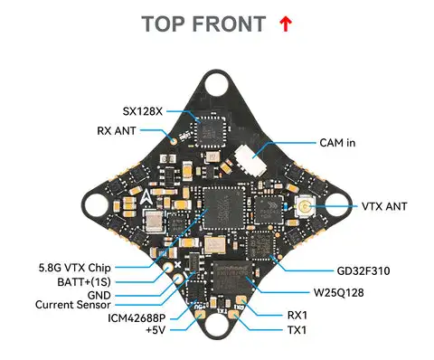
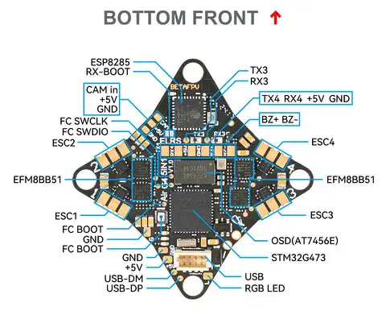

# Micro-UAV Swarm

The advent of micro-drones for FPV racing and 'freestyle' flying has led to the miniaturization of many previously heavy and complex systems. The development of small, lightweight, and low-cost system boards that are capable of performing all the tasks of a larger drone, Including inbuilt ESC's, Gyroscopes, IMU;s Accelerometers. We look to utilize these low cost fully integrated boards to create a swarm of microdrones.

  
  
  

we will utilize the commercially available boards known as 5-1's, such as the board found on the air65 analog whoop drone. Our microdrone will use the lowest cost components available. The purpose of keeping the drone small, light, and low cost is to allow for the use of a large number of drones in a small area. We will use coreless motors, and a single battery to power the drone, A small capacitor will be soldered to the board to store more energy. 

## Overview

Ours will be a microdrone that will use the esp-fly frame as a base. The coreless motors will be soldered to the board, and the battery will be soldered to the board. the drone will fly with its motors facing down, the props will be facing up. 

## Components

- 5-1 board - BETAFPV Air Brushless Flight Controller FC 4in1/5in1 5.8G VTX
- Brushless Motor 4PCS Upgrade 615 6x15mm 59000RPM Coreless Motors for Blade Inductrix H36 E010 FPV Brushed TinyWhoop DIY Quadcopter
- Battery 300mah 1S 3.8v batteries lavabatteries 30c 10a
- Capacitor 1000uF 16V
- 3D Printed Body keeping within the 55MM hexagonal frame 
- analog video system facing to the sky and facing to the ground, Each drone will have 2 cameras with the maximum FOV possible to cover the entire area of the drone, this will enable better SLAM and better target detection.

## Software

The 5-1 will be the brains of the operation, Given its minimal compute capacity and its betaflight firmware, It will be used to control the drone, and to send the video feed to the ground station that will make and send the decisions to the drone.

## Ground Station

The ground station will be a high powered portable laptop with the capability to run advanced computer vision models like yolo, with a 5.8Ghz VTX, and a 5.8Ghz Receiver. the reciever input will be a video feed from the drone camera system. the drone camera system will be a 1080p camera facing to the sky. The ground station will be a laptop with a 5.8Ghz Receiver, and a 5.8Ghz VTX. the laptop will run the computer vision model that will process the video feed in real time, and to make and send the decisions to the drone. Each drone will have 2 cameras facing to the sky and facing to the ground, and the maximum FOV possible to cover the entire area of the drone, this will enable better SLAM and better target detection. The decisions will be made by a computer vision model that will be trained to detect targets in the video feeds. The model will be trained on a dataset of targets from existing drone footage, and from test flights. Multiple drones will be controlled by a single ground station, and the ground station will have multiple hardware interfaces to control the drones. The ground station will be able to control the drones in a swarm, and the drones will be able to communicate with each other to build a SLAM map of the environment.

Ground station software:
- YOLOv8 VLM running in real time on the laptop
- SLAM software to build a map of the environment in real time
- Drone control software compatible with betaflight firmware
- Video receiver hardware and software
- Translation layer for the drone to understand the commands from the ground station
- EdgeTX hardware and software to send commands to the drone

## Documentation

For detailed implementation information, see:
- [Software Architecture](./software_architecture.md) - Complete system design and component overview
- [Implementation Guide](./implementation_guide.md) - Step-by-step code examples and setup instructions  
- [Recommendations](./recommendations.md) - Research findings and best practices for outdoor swarm operations
